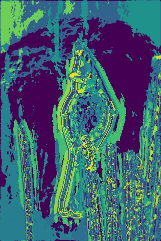
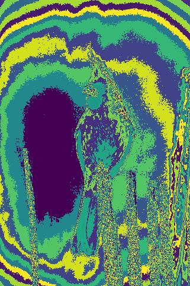
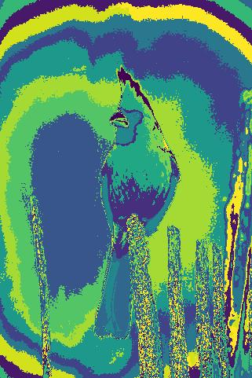
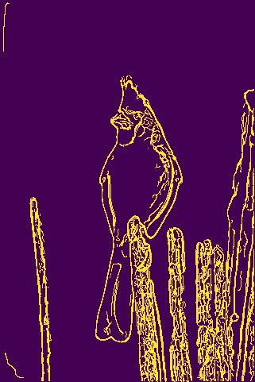

# Pb-Lite-Edge-detection
This repository implements boundary detection pipeline by applying filter banks, specifically implementing DoG filters, Leung-Malik Filters and Gabor Filters, to produce a texton map capturing image texture through clustered filter responses. 

<!-- ABOUT THE PROJECT -->
## About The Project

Edge detection is a key task in computer vision, involving
the identification of abrupt changes in intensity within images.
Traditionally, methods like the Sobel operator and the Canny
edge detector have been employed for this purpose. However,
the more recent Pb (Probability of Boundary) edge detection algorithm has surpassed these conventional techniques
by integrating information on texture, brightness and color
discontinuities in addition to intensity variations.  
In this project, we developed a simplified iteration of the
Pb algorithm known as Pb-Lite. Despite its streamlined design,
Pb-Lite exhibits moderate performance compared to the Canny
and Sobel edge detectors. This enhancement in edge detection
capabilities is crucial for more effective pattern recognition
and image analysis.

Input image           | Texton Map           | Brightness Map           |  Colour Map | Pb-lite output
:-------------------------:|:-------------------------: |:-------------------------: |:-------------------------: |:-------------------------:
 |  |  |  |   

## Run the Code:

1. Clone this repository
2. Execute the Phase 1 code by running the following command:
cd Phase1
python3 .\Code\Wrapper.py

## View Results:

The results 
1. Filters will be generated and stored in the "filters" directory.
2. Texton map, Color map, Brightness map, Texton gradient, Color gradient, Brightness gradient, output images and output with thresholding will be generated and stored in the "data/op_images" directory.
